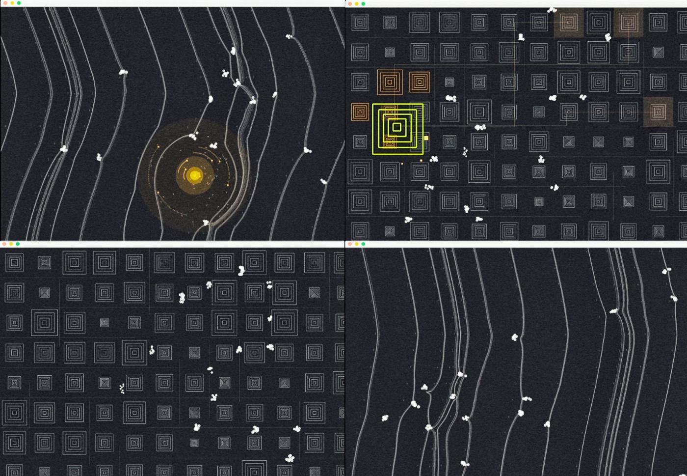

# WANDERERS

WANDERERS allows you to observe the life of little wanderers bustling about through their daily activities. If you so choose, you can also thoroughly disrupt it trough your interactions, much to the surprise of those little creatures. This little application shows a glimpse to two chapters of their endearing world.

### Youtube

Please watch the Youtube presentation to see this project in motion in its full interactive glory: https://www.youtube.com/watch?v=5K2bi5a3DL8

### Instructions

You can try the application yourself. Clone or download this repository to an OSX machine and run by double-clicking the application file at /bin/wanderers-release.app.

While the app is running, clicking with the mouse/touchpad spawns targets that wanderers are attracted to. Scene can be switched by pressing any key on the keyboard.

### Info

WANDERERS is the final project for the Aalto University course DOM-E5106 Generative Media Coding by Emil Lindfors. It was made during two weeks in Spring 2020. Technologies used: C++ and OpenFrameworks (v0.11.0).

Wanderers utilizes an OpenFrameworks addon called ofxPlayground, which I wrote during the course. It provides scene switching and drawing functions. The addon version compatible with Wanderers is stored in local_addons to minimize chance of future breakage. More information and possible future releases can be found in:

    https://github.com/emllnd/ofxplayground

For more of my work check out: https://emillindfors.com and https://github.com/emllnd

