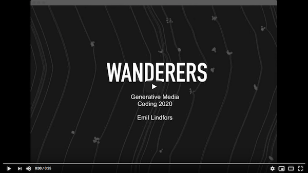

# wanderers-release

Final project by Emil Lindfors for course DOM-E5106 Generative Media Coding (Aalto University) in Spring 2020. OpenFrameworks/C++.

[TODO: video here]

### Instructions

Clone or download this repository to an OSX machine and you can try the application yourself by running the binary /bin/wanderers-release.app (double-click or Cmd+DownArrow to run).

While the app is running, clicking with the mouse/touchpad spawns targets that wanderers are attracted to. Scene can be switched by pressing any key on the keyboard.

### Info

Made with OpenFrameworks v0.11.0.

Wanderers utilizes an addon called ofxPlayground, which I wrote during the course. It provides scene switching and drawing functions. The addon version compatible with Wanderers is stored in local_addons to minimize chance of future breakage. If the addon gets developed further in the future, releases will be published in:

    https://github.com/emllnd/ofxplayground

For more of my work check out: https://emillindfors.com and https://github.com/emllnd

